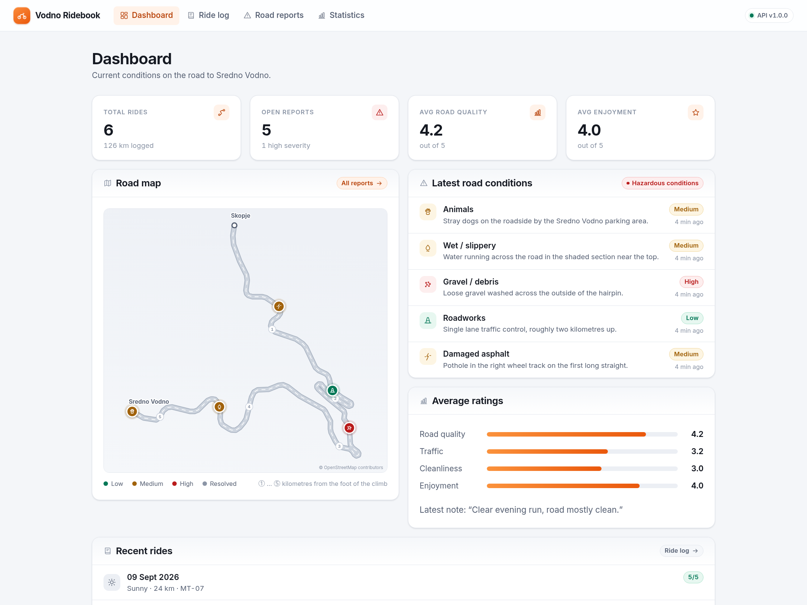

# Vodno Ridebook — Project Report

| | |
| --- | --- |
| **Course** | Continuous Integration and Delivery |
| **Author** | Viktor Najdovski |
| **Repository** | <https://github.com/VikiShmiki/vodno-ridebook> |

---

## 1. Introduction

### What Vodno Ridebook is

Vodno Ridebook is a small web application in the spirit of Waze, but written
for one specific group of users on one specific stretch of road: motorcyclists
riding up to **Sredno Vodno** in Skopje.

It does two things. Riders can **report road conditions** — gravel, standing
water, damaged asphalt, roadworks, heavy traffic, animals, poor visibility —
each with a severity and a position on the road, and they can **log rides**,
rating road quality, traffic, cleanliness and enjoyment. A dashboard combines
both into a picture of what the road is like right now.

### The problem it solves

A general navigation application answers "how do I get there". It does not
answer the question a motorcyclist actually asks before setting off: *what is
the surface like today?* Hazards that a car drives over without noticing are
the ones that matter most on two wheels. A patch of gravel on the exit of a
hairpin, a diesel spill, a pothole in the wheel track — none of these appear in
a routing app, and all of them change how, or whether, you ride.

### Why the Sredno Vodno road

The road to Sredno Vodno is the default weekend ride for Skopje motorcyclists:
a short, twisty climb out of the city that is busy with riders, cyclists and
hikers. It is a single well-defined route, which keeps the data model small —
positions can be reported as plain coordinates without any routing engine — and
it is a road where surface conditions genuinely change from week to week
because of runoff, gravel washed onto the tarmac and recurring roadworks.

### Purpose of the project

The application is deliberately modest. The purpose of the project is the
**DevOps implementation around it**: taking a realistic three-tier application
and building the complete path from a commit in a Git repository to a running,
self-healing, updatable deployment in Kubernetes. The application exists to
give that pipeline something real to carry: containerisation, local
orchestration with Docker Compose, an automated CI/CD pipeline in GitHub
Actions, publishing to a container registry, and a Kubernetes deployment with
configuration management, persistent storage, ingress routing, self-healing and
zero-downtime rolling updates.

---

## 2. Application architecture

The system is a conventional three-tier application.

```text
        Browser — React 19 SPA (Vite build, TypeScript)
                          │  REST, relative /api/... paths
                          ▼
   Routing layer:  Vite proxy (dev) · nginx (Compose) · Ingress (K8s)
              │ "/"                        │ "/api"
              ▼                            ▼
   Static bundle (nginx)          FastAPI / uvicorn :8000
                                           │  SQLAlchemy 2.0 · psycopg 3
                                           ▼
                                  PostgreSQL 16
                          motorcycles · rides · road_reports
```

### Frontend

React 19 with Vite and TypeScript, using React Router for four pages —
Dashboard, Ride log, Road reports and Statistics. There is no state-management
library; a small `useAsync` hook handles loading, error and reload state for
each fetch. Road reports are drawn on an SVG map whose centreline is the
**real OpenStreetMap geometry** of the climb — 100 points, simplified to under
one pixel of error, committed to the repository by
`scripts/fetch-road-geometry.py` and projected at a single uniform scale so the
hairpins are undistorted. Reports are snapped to the nearest point on that
line. Drawing the road rather than loading map tiles avoids an API key and a
runtime dependency; likewise the icons are inline SVG and the Inter webfont is
served from the image, so the application makes no third-party request.

### Backend

FastAPI with SQLAlchemy 2.0 and Pydantic v2, organised into routers
(`health`, `rides`, `reports`, `motorcycles`, `stats`), ORM models and Pydantic
schemas. Pydantic validates every request: ratings must be 1–5, weather and
report categories must be members of the defined enumerations, and report
coordinates must fall inside a bounding box around the Vodno road. All
configuration is read from environment variables through `pydantic-settings`,
so nothing environment-specific is compiled into the image.

### Database

PostgreSQL 16 with three tables — `motorcycles`, `rides` and `road_reports`.
`rides.motorcycle_id` is a nullable foreign key with `ON DELETE SET NULL`, so a
ride remains a valid record after its motorcycle is removed.

### Communication between services

The frontend never uses an absolute API URL. It always requests relative
`/api/...` paths, and whatever sits in front of it decides where they go:

| Environment    | `/api` is resolved by                            |
| -------------- | ------------------------------------------------ |
| `npm run dev`  | the Vite dev proxy → `localhost:8000`            |
| Docker Compose | nginx in the frontend container → `backend:8000` |
| Kubernetes     | the Ingress → the backend Service                |

This is the single most useful decision in the project: **the same frontend
image runs unchanged in every environment**, which is what makes "the artifact
tested in CI is the artifact deployed to production" true rather than
aspirational.

### API surface

Twelve REST endpoints are served under `/api`, with interactive documentation
at `/api/docs`: full CRUD for `rides` and `reports`, list/create for
`motorcycles`, an aggregate `stats` endpoint and `health`. The complete table
is in the README.

`GET /api/health` runs `SELECT 1` against the database and returns `503` when
that fails. This matters for the Kubernetes section: a pod that has lost its
database is taken out of the Service endpoints instead of returning errors.

---

## 3. Dockerization

Both services are containerised separately with multi-stage builds.

### Backend Dockerfile

Stage one, on `python:3.12-slim`, creates a virtualenv at `/opt/venv` and
installs the pinned requirements. Stage two starts from the same slim base,
copies only the finished virtualenv and the `app` package, and never sees pip's
caches or build tooling. A dedicated user is created and the image ends with
`USER vodno` (uid 1001), so no application code runs as root. A `HEALTHCHECK`
calls `/api/health` using the standard library, avoiding an extra `curl`
dependency.

### Frontend Dockerfile

Stage one, on `node:24-alpine`, copies `package.json` and `package-lock.json`
first and runs `npm ci` before the source is copied, so the dependency layer is
reused whenever only application code changes. It then runs `npm run build`.
Stage two is `nginxinc/nginx-unprivileged:1.27-alpine`, which listens on 8080
as uid 101 without root, and receives only the compiled `dist` directory plus
an nginx configuration template.

### Resulting images

| Image             | Size    | Runs as        |
| ----------------- | ------- | -------------- |
| `vodno-frontend`  | 74.4 MB | `uid=101(nginx)` |
| `vodno-backend`   | 311 MB  | `uid=1001(vodno)` |

Both were verified with `docker compose exec <service> id` in the running
containers.

### Important configuration decisions

- **Nothing is hardcoded.** The backend reads database host, port, name,
  credentials, CORS origins and log level from the environment. The frontend's
  nginx configuration is a template with a `${BACKEND_URL}` placeholder that the
  nginx entrypoint renders with `envsubst` at container start — so the proxy
  target can change without rebuilding the image.
- **`.dockerignore` in both contexts** keeps `node_modules`, `.venv`, test
  directories, caches and any `.env` file out of the build context. Excluding
  `.env` is a security measure as much as a size one.
- **nginx serves the SPA correctly**: `try_files` falls back to `index.html` so
  client-side routes work on a hard refresh, `index.html` is sent with
  `Cache-Control: no-store` so a rolling update is picked up on reload, while
  hashed assets under `/assets/` are marked immutable for a year.

---

## 4. Docker Compose

```bash
cp .env.example .env
docker compose up --build
```

The application is then available at <http://localhost:8080>.

### The three services

| Service    | Image                       | Port          | Role                          |
| ---------- | --------------------------- | ------------- | ----------------------------- |
| `postgres` | `postgres:16-alpine`        | 5432 internal | Database                      |
| `backend`  | built from `./backend`      | 8000          | FastAPI API                   |
| `frontend` | built from `./frontend`     | 8080 → 8080   | Static bundle + `/api` proxy  |

### Networking

All three join a user-defined bridge network, `vodno-network`, and address each
other by service name — the backend connects to `postgres:5432`, and nginx
proxies to `backend:8000`. PostgreSQL deliberately publishes **no** host port;
it is reachable only from inside the network.

### Environment variables

Every value comes from `.env`, which is created from the committed
`.env.example` and is itself git-ignored. Compose substitutes defaults with the
`${VAR:-default}` syntax, so the stack still starts if a variable is missing.

### PostgreSQL persistence

The database directory is a named volume, `vodno_postgres_data`, with `PGDATA`
pointing one level below the mount point. Data therefore survives
`docker compose down`; only `docker compose down -v` removes it. Verified:

```console
$ docker compose down && docker compose up -d
$ curl -s http://localhost:8080/api/rides | python3 -c "import sys,json;print(len(json.load(sys.stdin)))"
7
```

### Health checks and dependencies

Each service defines a health check — `pg_isready` for PostgreSQL, an HTTP call
to `/api/health` for the backend, and `/healthz` for the frontend — and
`depends_on` uses `condition: service_healthy`. Compose therefore starts them
in strict order: postgres becomes healthy, then the backend, then the frontend.

```text
SERVICE    STATE     STATUS                   PORTS
backend    running   Up 2 minutes (healthy)   0.0.0.0:8000->8000/tcp
frontend   running   Up 8 seconds (healthy)   0.0.0.0:8081->8080/tcp
postgres   running   Up 2 minutes (healthy)   5432/tcp
```

---

## 5. CI/CD pipeline

Two workflows, in `.github/workflows/`.

### `ci.yml` — pull requests and feature branches

```text
checkout
  ├─ frontend  → npm ci → oxlint → tsc -b → Vitest → vite build → upload dist
  ├─ backend   → pip install → ruff check → ruff format --check
  │               → pytest against a PostgreSQL 16 service container
  │               → assert the OpenAPI schema exposes the required routes
  ├─ docker-build       → Buildx builds both images (matrix), no push
  └─ compose-smoke-test → docker compose up --build -d, then curl
                          /healthz, /api/health, /api/stats, /api/reports
```

Two details are worth calling out. First, the backend suite runs against a real
**PostgreSQL 16 service container**, the same major version used in Compose and
Kubernetes, rather than against a substitute database. Second, the
`compose-smoke-test` job starts the entire stack and exercises it over HTTP, so
a change that passes the unit tests but breaks the container wiring — a wrong
proxy target, a missing environment variable — is caught before merge. Nothing
is published from a pull request.

### `cd.yml` — pushes to `main`

```text
git push to main
      ↓
CI gate  (ci.yml re-used via workflow_call — byte-identical checks)
      ↓
build both images with Buildx (GitHub Actions layer cache)
      ↓
push to ghcr.io, tagged:  latest · <short-sha> · <full-sha>
      ↓
[only when a KUBE_CONFIG secret exists]
kubectl apply -f k8s/  →  kubectl set image  →  kubectl rollout status
```

Re-using `ci.yml` through `workflow_call` rather than copying the steps means
`main` can never be published under weaker checks than a pull request.

### Image tagging

```text
ghcr.io/vikishmiki/vodno-backend:latest · :<short-sha> · :<full-sha>
ghcr.io/vikishmiki/vodno-frontend:latest · :<short-sha> · :<full-sha>
```

`latest` is the readable tag used by the manifests; the commit SHA is the
immutable one used by the deployment step, so any running pod can be traced
back to the exact commit it was built from. OCI labels record the source
repository and revision inside the image itself.

### Secrets

No credential appears in any file in the repository. Two are used:
`GITHUB_TOKEN`, which GitHub Actions provides automatically and which
authenticates the push to GHCR, and the optional `KUBE_CONFIG` repository
secret holding a base64-encoded kubeconfig for the deploy job.

Because the `secrets` context is not available in a job-level `if`, the
`publish` job turns the presence of `KUBE_CONFIG` into a job output, and the
`deploy` job keys off that. When no cluster is configured the deploy job is
skipped and the pipeline still succeeds.

### CD mechanism

The chosen approach is GitHub Actions running `kubectl` directly. It is a
single readable file, it needs nothing installed in the cluster, and the whole
mechanism can be explained in one slide. Argo CD was considered and rejected as
more infrastructure than this project can justify; the trade-off is noted in
`docs/architecture.md`.

The workflows are linted with `actionlint`, which reports no findings.

> **Verification note.** The CI/CD workflows are implemented and statically
> validated, and every check they run — ruff, pytest, oxlint, `tsc`, Vitest,
> both image builds and the Compose smoke test — was executed locally and
> passes. The registry push and the `deploy` job execute on GitHub's runners
> once the repository is pushed and, for `deploy`, once `KUBE_CONFIG` is set.

---

## 6. Kubernetes architecture

Everything runs in a dedicated namespace, **`vodno-ridebook`**.

```text
                    Internet / laptop  →  http://vodno.local
                                  │
                      ingress-nginx  ·  Ingress vodno-ingress
                     "/" │                          │ "/api"
                         ▼                          ▼
              Service frontend :80         Service backend :8000
                 (ClusterIP)                    (ClusterIP)
                    │      │                     │      │
              ┌─────┘      └─────┐         ┌─────┘      └─────┐
           frontend pod    frontend pod  backend pod    backend pod
           nginx :8080     nginx :8080     :8000          :8000
           probe /healthz                  probe /api/health
                                                 │
                                    Service postgres (headless)
                                                 │
                                     postgres-0  (StatefulSet)
                                                 │
                                  PVC data-postgres-0 · 1Gi · RWO

   ConfigMap vodno-config → backend, frontend
   Secret    vodno-secret → backend, postgres
   Namespace vodno-ridebook contains everything above
```

### Namespace

`vodno-ridebook` isolates the application: the whole system can be inspected
with `kubectl get all -n vodno-ridebook` and removed with one namespace
deletion.

### Deployments and replicas

The backend and frontend each run **two replicas** with
`podAntiAffinity` preferring different nodes. Both use a `RollingUpdate`
strategy with `maxUnavailable: 0` and `maxSurge: 1`, and both set CPU and
memory requests and limits.

### Services

`frontend` (ClusterIP :80) and `backend` (ClusterIP :8000) are ordinary
ClusterIP Services. `postgres` is **headless** (`clusterIP: None`), which is the
right pairing for a StatefulSet: it gives the pod the stable DNS name
`postgres-0.postgres.vodno-ridebook.svc.cluster.local`, and the backend simply
connects to `postgres`.

### Ingress

One `Ingress` object, one hostname. `ingress-nginx` matches Prefix rules
longest-first, so `/api` reaches the backend and everything else falls through
to the frontend — the entire application is served from `http://vodno.local`.

### ConfigMap and Secret

`vodno-config` holds eight non-sensitive settings: application environment, log
level, database host, port and name, CORS origins, the seed flag and the
frontend's backend URL. `vodno-secret` holds `POSTGRES_USER` and
`POSTGRES_PASSWORD`. The backend consumes both with `envFrom`; PostgreSQL uses
`secretKeyRef` and `configMapKeyRef`.

**No real credential is committed.** `k8s/examples/secret.example.yaml` is a
template containing only `REPLACE_WITH_A_REAL_PASSWORD`, and it lives in a
subdirectory precisely because `kubectl apply -f k8s/` does not recurse — it
cannot be applied by accident. The deployment script generates the real Secret
imperatively with `openssl rand -base64 24`.

### PostgreSQL StatefulSet and PersistentVolumeClaim

PostgreSQL runs as a StatefulSet with one replica and a `volumeClaimTemplates`
entry requesting 1 Gi `ReadWriteOnce` storage. This produces the claim
`data-postgres-0`, which is re-attached to the pod on every restart. The pod
runs as uid 999 with `fsGroup: 999` so the mounted volume is writable.

### Health probes

| Workload   | Startup                       | Readiness            | Liveness             |
| ---------- | ----------------------------- | -------------------- | -------------------- |
| `backend`  | `/api/health`, up to 90 s     | `/api/health`, 10 s  | `/api/health`, 20 s  |
| `frontend` | —                             | `/healthz`, 10 s     | `/healthz`, 20 s     |
| `postgres` | —                             | `pg_isready`, 5 s    | `pg_isready`, 15 s   |

The backend's startup probe gives it time to wait for PostgreSQL on a cold
start without the liveness probe killing it. The frontend probes `/healthz`,
which nginx answers itself — a backend outage must not restart the web tier.

### Security context

Both application pods run with `runAsNonRoot`, `readOnlyRootFilesystem: true`,
`allowPrivilegeEscalation: false`, all capabilities dropped and the
`RuntimeDefault` seccomp profile; the writable paths each service genuinely
needs are `emptyDir` volumes.

---

## 7. Kubernetes demonstrations

All output below is copied from real runs on a three-node kind cluster
(Kubernetes v1.34.0) with `ingress-nginx`. The full guide is in
[`docs/demos.md`](demos.md).

### Cluster state

```console
$ kubectl get pods -n vodno-ridebook -o wide
NAME                        READY   STATUS    RESTARTS   NODE
backend-b55bd665b-2qcdw     1/1     Running   0          vodno-worker
backend-b55bd665b-5qbgr     1/1     Running   0          vodno-worker2
frontend-788ff4c77c-tqhcl   1/1     Running   0          vodno-worker2
frontend-788ff4c77c-vjqmh   1/1     Running   0          vodno-worker
postgres-0                  1/1     Running   0          vodno-worker2

$ kubectl get services -n vodno-ridebook
NAME       TYPE        CLUSTER-IP      PORT(S)
backend    ClusterIP   10.96.186.215   8000/TCP
frontend   ClusterIP   10.96.127.44    80/TCP
postgres   ClusterIP   None            5432/TCP

$ kubectl get ingress -n vodno-ridebook
NAME            CLASS   HOSTS         PORTS   AGE
vodno-ingress   nginx   vodno.local   80      31s
```

The anti-affinity rule placed the two backend replicas on different worker
nodes, which is what makes the self-healing demonstration meaningful.

### Access through the Ingress

```console
$ curl -s http://vodno.local/api/health
{"status":"healthy","database":"connected","version":"1.0.0","environment":"production"}

$ curl -o /dev/null -s -w "%{http_code}\n" http://vodno.local/        # 200
$ curl -o /dev/null -s -w "%{http_code}\n" http://vodno.local/stats   # 200
```

The last request is a client-side route: nginx falls back to `index.html` and
React Router renders the Statistics page.



*The dashboard at `http://vodno.local`, served by the frontend pods with data
fetched from the backend pods — both reached through the single Ingress.*

### ConfigMap and Secret reaching the container

```console
$ kubectl exec -n vodno-ridebook backend-5947bbb96c-bbbf7 -- \
    printenv APP_ENV POSTGRES_HOST POSTGRES_DB CORS_ORIGINS
production
postgres
vodno
http://vodno.local
```

The Secret arrives the same way; `kubectl get secret vodno-secret -o
jsonpath="{.data.POSTGRES_USER}" | base64 -d` returns `vodno`, and the password
is the one generated at deployment time, not one taken from the repository.

### Self-healing

`./scripts/demo-self-healing.sh` polls `/api/health` twice a second while one
backend pod is deleted.

```text
==> Polling the API while 'backend-b55bd665b-2qcdw' is deleted
.pod "backend-b55bd665b-2qcdw" deleted from vodno-ridebook namespace
...........................................................

==> Backend pods after (a replacement is created automatically)
NAME                      READY   STATUS    RESTARTS   AGE   NODE
backend-b55bd665b-5qbgr   1/1     Running   0          81s   vodno-worker2
backend-b55bd665b-xhcwh   1/1     Running   0          31s   vodno-worker

Legend: '.' = request served, 'X' = request failed
```

**60 of 60 requests were served; none failed.** The ReplicaSet scheduled
`backend-b55bd665b-xhcwh` as a replacement while the surviving replica
continued to answer.

### Persistent database storage

`./scripts/demo-persistence.sh` writes a uniquely tagged ride, deletes
`postgres-0`, and checks the data afterwards.

```text
==> Writing a ride tagged 'persistence-check-1788976855'
    total rides before: 7

NAME              STATUS   VOLUME                       CAPACITY   ACCESS MODES
data-postgres-0   Bound    pvc-67cdb7fa-01bc-47b1-…     1Gi        RWO

==> Deleting the PostgreSQL pod
pod "postgres-0" deleted from vodno-ridebook namespace
pod/postgres-0 condition met

    total rides after : 7
    marker rides found: 1
PASS: the data survived the pod deletion
```

The recreated pod kept the name `postgres-0` and re-bound the same claim. A
Deployment would have produced a pod with a new random name and, without a
claim template, an empty database.

### Rolling update

`./scripts/demo-rolling-update.sh v2` builds a new tag and rolls it out while
polling the API.

```text
==> Image currently running:  ghcr.io/vikishmiki/vodno-backend:latest

==> Rolling out while polling the API
.deployment.apps/backend image updated
Waiting for rollout: 1 out of 2 new replicas have been updated...
..................Waiting for rollout: 1 old replica is pending termination...
...................deployment "backend" successfully rolled out
..........................................

==> Image now running:  ghcr.io/vikishmiki/vodno-backend:v2
```

**80 of 80 requests were served with zero failures.**

This result was not free. The first measured rollout recorded one failed
request: endpoint removal and `SIGTERM` reach a terminating pod concurrently,
so for a moment the Ingress could still route to a pod that had started
shutting down. A five-second `preStop` hook, which removes the pod from the
load balancers before uvicorn shuts down, brought the failure count to zero —
a good illustration of why "zero downtime" has to be measured, not assumed.

---

## 8. Results and conclusion

### What was implemented

A complete, working path from source code to a running Kubernetes deployment:

- A three-tier application with 31 automated tests (21 backend, 10 frontend),
  clean linting on both sides and a database-aware health endpoint.
- Multi-stage Docker images for both services (74 MB and 311 MB), non-root with
  read-only root filesystems.
- A Docker Compose stack with health checks, ordered startup, a private network
  and a persistent named volume.
- A CI pipeline: linting, type checking, tests against a real PostgreSQL
  service container, an OpenAPI contract assertion, image builds and a full
  Compose smoke test — and a CD pipeline re-using that gate, publishing to GHCR
  under `latest` and commit-SHA tags and rolling the Deployments.
- Kubernetes manifests: dedicated namespace, ConfigMap, Secret (safe committed
  template), PostgreSQL StatefulSet with a PersistentVolumeClaim, two-replica
  Deployments with probes, limits, anti-affinity and a PodDisruptionBudget, and
  an Ingress serving everything on one hostname.
- Scripted demonstrations of self-healing, persistence and zero-downtime
  rolling updates, all verified on a real three-node cluster.

### Technologies used

| Area              | Technology                                                    |
| ----------------- | ------------------------------------------------------------- |
| Version control   | Git, GitHub                                                    |
| Frontend          | React 19, Vite 8, TypeScript, React Router, oxlint, Vitest     |
| Backend           | Python 3.12, FastAPI, SQLAlchemy 2, Pydantic v2, ruff, pytest  |
| Database          | PostgreSQL 16                                                  |
| Containers        | Docker, multi-stage builds, Docker Compose                     |
| CI/CD             | GitHub Actions, Buildx, actionlint, Dependabot                 |
| Registry          | GitHub Container Registry (GHCR)                               |
| Orchestration     | Kubernetes 1.34, kind, ingress-nginx, kubectl                  |

### What was learned

Three things stand out.

**Running the demonstrations found real bugs.** Deploying two backend replicas
exposed a startup race in which both seeded the database, producing twelve
rides instead of six — something a single replica or Docker Compose could never
have revealed. The fix, running schema creation and seeding inside a PostgreSQL
advisory lock, applies to any multi-replica service with startup work.

**"Zero downtime" is a measurement, not a configuration flag.** Setting
`maxUnavailable: 0` and adding readiness probes felt like enough, and the
rollout still dropped a request. Only polling the API through the rollout
revealed it, and only then did the missing piece — a `preStop` drain hook —
become obvious.

**Small architectural decisions pay off across the pipeline.** Choosing
relative `/api` paths instead of a build-time API URL meant one frontend image
for every environment. That one decision is what makes the CI smoke test
meaningful: the container tested in the pipeline is byte-identical to the one
that runs in Kubernetes.

### Possible future improvements

- **Authentication** — JWT, with the signing key added to the existing Secret.
- **Alembic migrations** in an init container, replacing `create_all` once the
  schema starts to evolve.
- **Observability** — a Prometheus metrics endpoint, a Grafana dashboard and
  structured JSON logs.
- **Argo CD** — moving to GitOps would remove the ordering constraint between
  `kubectl apply` and `kubectl set image`.
- **A highly available database**, for example via the CloudNativePG operator.
- **Real map tiles and GPS capture**, so a rider can report a hazard from the
  roadside instead of typing coordinates.

### Conclusion

The project set out to demonstrate a complete continuous integration and
delivery workflow rather than a large application, and the small size of Vodno
Ridebook turned out to be the right choice: it left room to get the pipeline
right, to measure what it claimed, and to fix the two real defects that
measurement uncovered. The result is a system that can be built, tested,
published, deployed, updated and recovered without a manual step outside
`git push`.
